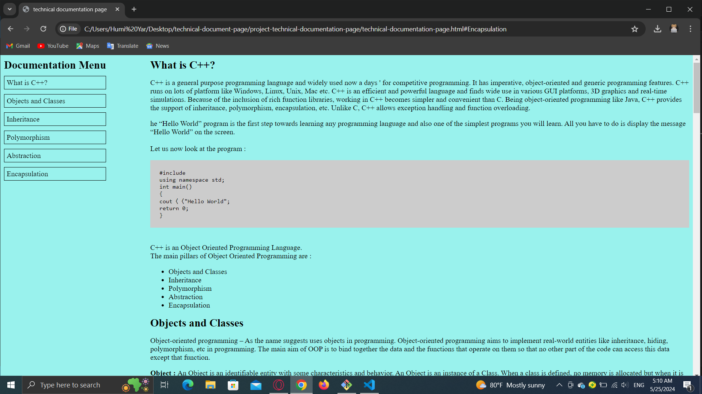

# Project Technical Documentation Page 🚀

## Project Description 📝

I create this project becuase of learning there was some problem i face to it first that i should insert some text inside html tag it should not be empty.
I learn a lot things in this project special responsive the page an media query and also i can show other language code in html. the simple design that i use it it make my project stand out 

```html
<code>
    #include<iostream> <br>
    using namespace std;<br>
    int main()<br>
    {<br>
    cout〈〈"Hello World";<br>
    return 0; <br>
    } 
</code>
```

```css
div.main-body {
  display: grid;
  grid-template-columns: minmax(300px, auto) 1fr;
  grid-template-areas: "navbar mainContent";
  grid-gap: 20px;
}
```
## Demo 📸



## Technologies Used 🛠️
- HTML
- CSS

## Installation 💻

```clone
  git clone git@github.com:humuyar/project-technical-documentation-page.git
```

## Usage 🎯

```cd project-technical-documentation-page
```
```code .
```
```git add .
```
```git commit -m "anything you want"
```
```git push
``

## Features ⭐
- This website is a resposive website. 

## Author 👩‍💼
Humaira ✨Qabooli✨
- Github: https://github.com/humuyar/project-technical-documentation-page✔
- LinkedIn: [www.linked in/Humaira (Hmui) Qabooli.com](https://www.linkedin.com/in/humaira-qabooli-0aa529309/)✔
- Email: humiq6071@gmail.com✔

## Contributing 🤝
🎇 by using this link you can share your opinion : https://github.com/humuyar/project-technical-documentation-page

